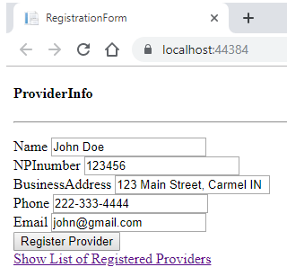

# Repo001

ProviderRegistrationASP.NETcoreMVC
------------------------------------

This is a simple ASP.NET Core MVC app for registering providers. The app can easily be published/deployed to Azure.

The entered provider info is stored in a strongly typed static collection for simplicity.

#### Screenshot 1/5: Registration form

#### Screenshot 2/5: Data Input

#### Screenshot 3/5: Saved, thanks

#### Screenshot 4/5: Registrations list

#### Screenshot 5/5: Validation

